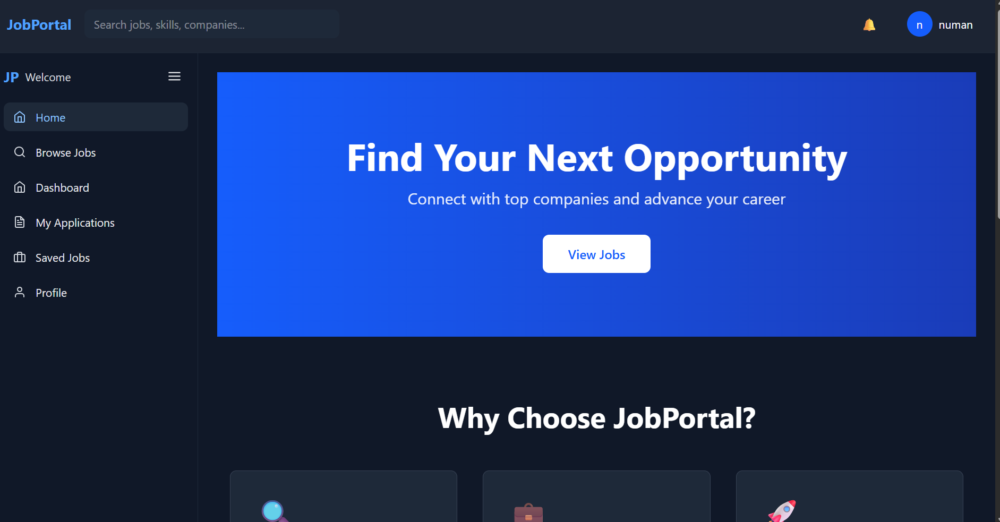
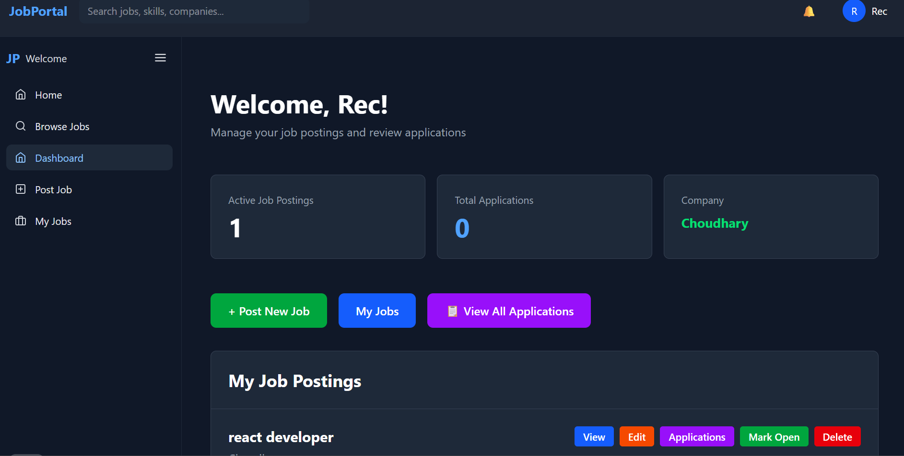
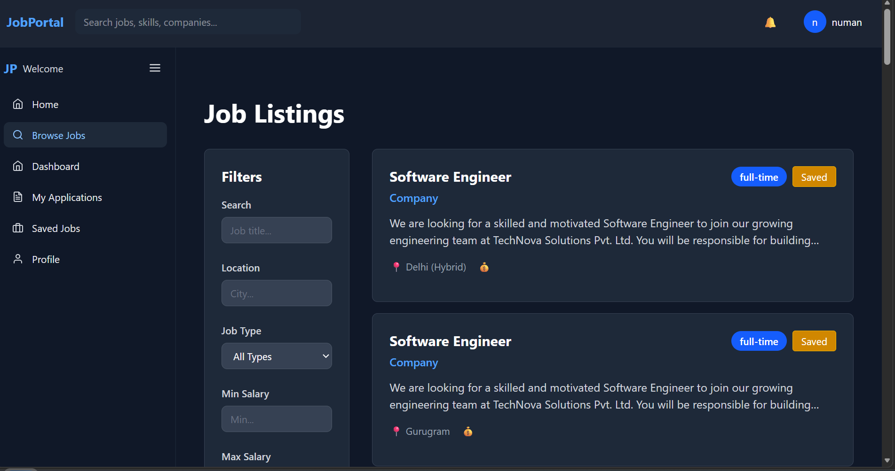
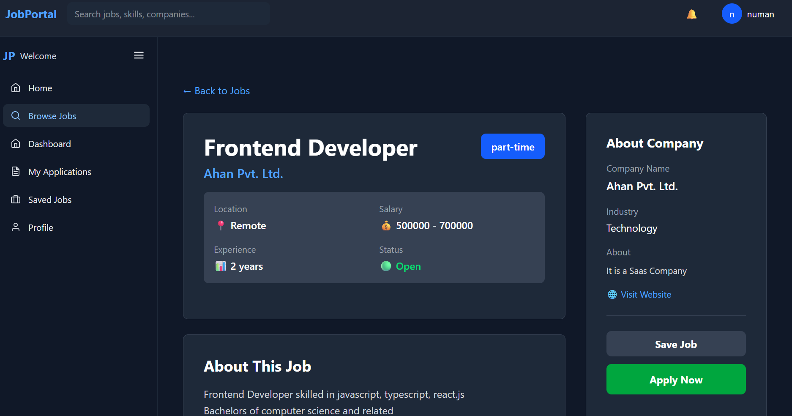
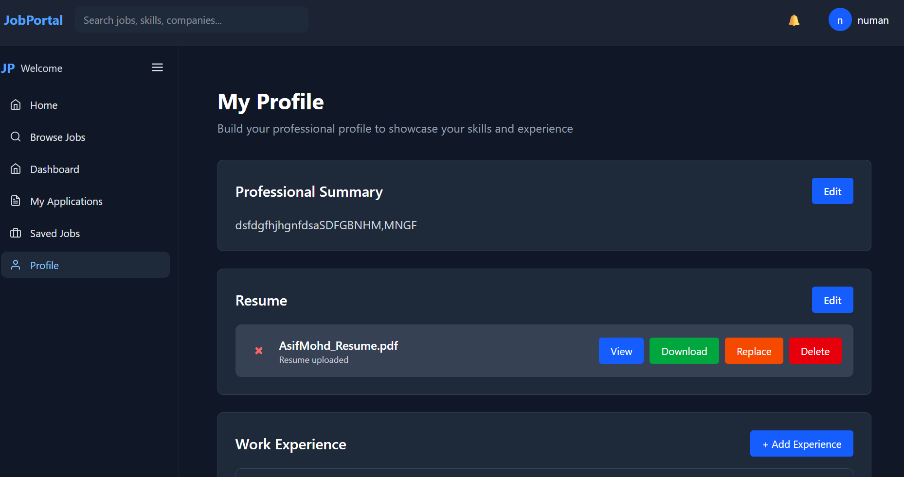
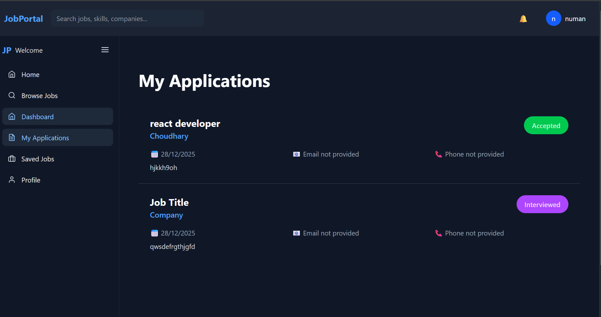
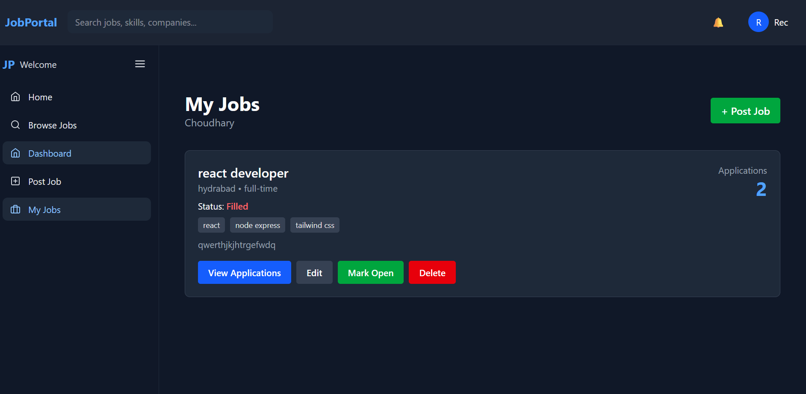
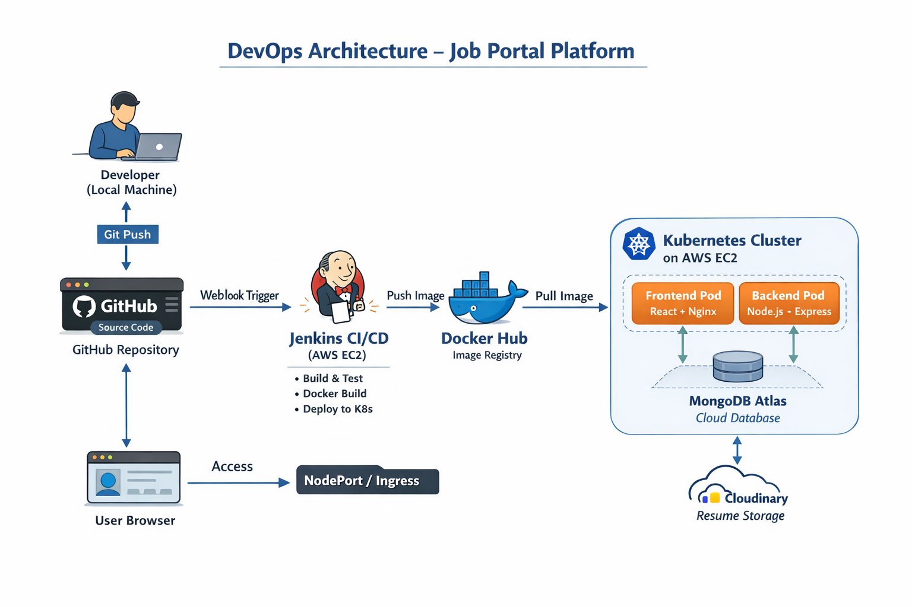

---
# Job Portal Platform – Full Stack with DevOps

This is a **full-stack Job Portal Platform** built to support real-world hiring workflows.
The platform allows **candidates to create profiles and apply for jobs**, while **recruiters post jobs and manage applications**.
The project includes a **complete CI/CD pipeline using Jenkins, Docker, and Kubernetes**, deployed on **AWS EC2**.
---

## Table of Contents

- Features
- Technologies Used
- Project Structure
- Prerequisites
- Local Development Setup
- CI/CD Pipeline
- Deployment
- Scripts
- Screenshots
- Contact

---

## Features

### Candidate

- Create and manage detailed profile
- Upload, view, and download resume (Cloudinary)
- Browse and apply for jobs
- Track applied jobs

### Recruiter

- Create, update, and delete job postings
- View only jobs posted by them
- View candidate applications
- Access candidate profiles in read-only mode

### DevOps

- Automated CI/CD pipeline using Jenkins
- Dockerized frontend and backend
- Kubernetes deployment on AWS EC2 (single-node cluster)
- ReplicaSets for high availability
- Load balancing and health monitoring
- Rolling updates and rollbacks using Helm charts

---

## Technologies Used

### Application

- **Frontend:** React (Vite), Tailwind CSS
- **Backend:** Node.js, Express.js
- **Database:** MongoDB Atlas
- **Authentication:** JWT
- **Media Storage:** Cloudinary

### DevOps

- **Docker:** Containerization
- **Docker Hub:** Image registry
- **Jenkins:** CI/CD automation
- **Kubernetes:** Container orchestration
- **Helm:** Kubernetes package management
- **AWS EC2:** Infrastructure

---

## Project Structure

```
Job-Portal/
├── client/                   # React frontend
├── server/                   # Node.js backend
├── devops/
│   ├── docker/               # Dockerfiles
│   ├── jenkins/              # Jenkinsfile
│   ├── helm/                 # Helm charts
│   └── deployment-setup.md   # DevOps documentation
├── screenshots/              # Project screenshots
└── README.md
```

---

## Prerequisites

Make sure the following tools are installed:

- Node.js and npm
- Docker and Docker Hub account
- Jenkins
- Kubernetes (`kubectl`)
- Helm
- AWS EC2 (Ubuntu instance)

---

## Local Development Setup

### Clone the repository

```bash
git clone https://github.com/asifmohd01/Job-Portal.git
cd Job-Portal
```

### Backend Setup

```bash
cd server
npm install
npm run dev
```

Backend runs on:

```
http://localhost:5000
```

### Frontend Setup

```bash
cd client
npm install
npm run dev
```

Frontend runs on:

```
http://localhost:5173
```

---

## CI/CD Pipeline

### Jenkins Pipeline

This project uses **Jenkins for CI/CD automation**.

The pipeline performs:

- Cloning the GitHub repository (single source of truth)
- Building Docker images for frontend and backend
- Pushing images to Docker Hub
- Deploying the application to Kubernetes using Helm

### Pipeline Steps

1. **Clone Repository** – Jenkins pulls the latest code from GitHub
2. **Build Docker Images** – Docker builds production-ready images
3. **Push to Docker Hub** – Images are pushed to the registry
4. **Deploy to Kubernetes** – Helm performs rolling updates

---

## Deployment

### Docker

- Frontend and backend are containerized
- Images are stored in Docker Hub

### Kubernetes

- Single-node Kubernetes cluster on AWS EC2
- ReplicaSets for availability
- Services for load balancing
- Health checks and self-healing pods

### Helm

- Application deployed using Helm charts
- Version-controlled deployments
- Supports rollback and controlled rollouts

---

## Scripts

Infrastructure setup commands (Docker, Kubernetes, Jenkins installation) are **documented in `devops/deployment-setup.md`** instead of scripts, as they are one-time environment setup steps.

This keeps the repository clean and production-aligned.

---

## Screenshots

Got it 👍
Below is a **clean, short, professional `README.md` screenshots section**, written **exactly in the style you showed**, but adapted for **your Job Portal project**.

You can **copy-paste this directly** into your `README.md`.

---

## 📸 Screenshots

### Home Page



* **Platform Overview**: Landing page introducing the job portal with role-based access for candidates and recruiters.

---

### Candidate Dashboard


* **Candidate Overview**: Displays applied jobs, profile completion status, and quick access to profile sections.

---

### Recruiter Dashboard



* **Recruiter Overview**: Shows jobs posted by the recruiter, application counts, and hiring activity.

---

### Job Listings



* **Browse Jobs**: Candidates can browse and filter jobs by location, skills, and job type.

---

### Job Details



* **Job Description View**: Complete job details with apply option and recruiter information.

---

### Candidate Profile



* **Profile Management**: Section-wise editable profile including summary, experience, skills, education, and resume.

---

### Candidate Applications


---

### Recruiter – Applications View



* **Application Management**: Recruiters can view candidate applications and access candidate profiles in read-only mode.

---

### Recruiter – Post Job


---

### Jenkins CI/CD Pipeline



* **CI/CD Automation**: Jenkins pipeline showing build, Docker image creation, push, and Kubernetes deployment.

---

<!-- ### Kubernetes Deployment


* **Kubernetes Cluster**: Running pods, services, and deployments on AWS EC2 using Helm charts.

--- -->

## Contact

**Asif Mohd**  
B.Tech – Information Science & Engineering  

📞 Phone: +91 8491040620
📧 Email: [asifmohd3840@gmail.com](mailto:asifmohd3840@gmail.com)    
🔗 GitHub: [https://github.com/asifmohd01](https://github.com/asifmohd01)  
🔗 LinkedIn: [https://linkedin.com/in/asifmohd01](https://linkedin.com/in/asifmohd01)  
🔗 Portfolio: [https://asifmohd-portfolio.vercel.app/](https://asifmohd-portfolio.vercel.app/)

---
